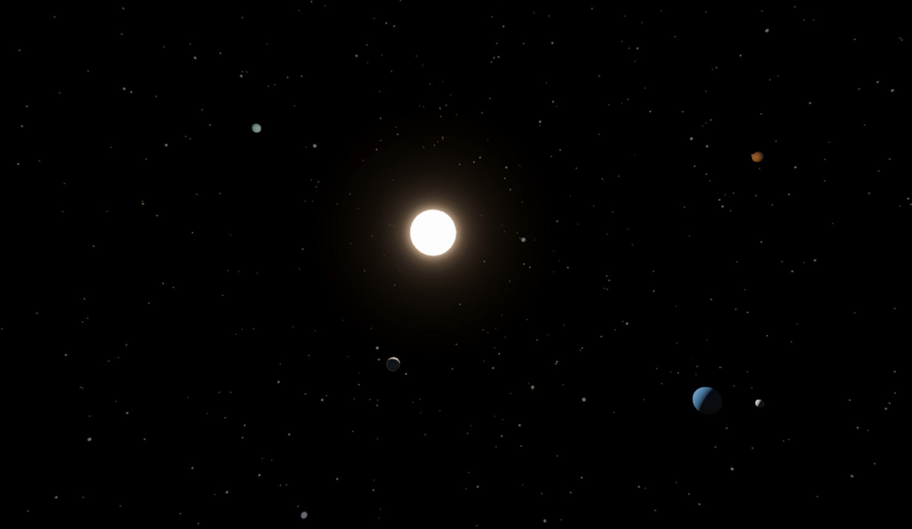
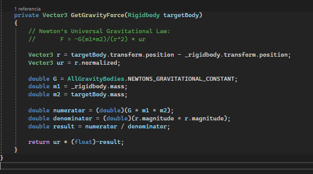
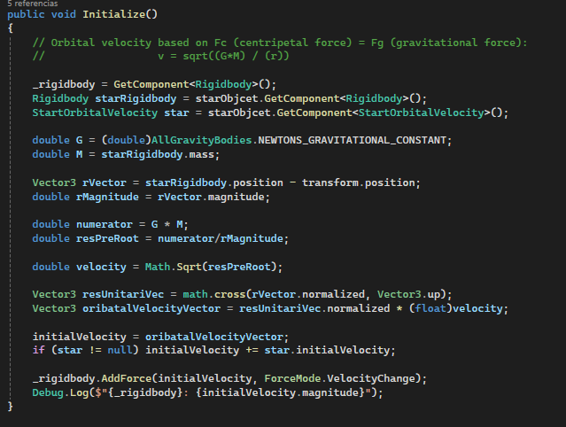

# Orbits Demo
**Concept:** Quick physics demo that simulates a simple Star system with a center Star, 3 planets orbiting and the main Rocket.
The idea is to simulate gravity fields from the Star and the different planets based on its masses and distances and how that affects the rocket.

---

---

**Physics:** Newton's Law of Universal Gravitation
Every Object applies Gravity to eachother based on *Newton's Gravitational Law* with a custom *G* constant in order to make it more dynamic.
A GameManager initializes every object with a *Orbital Speed* based on the principle *Centripetal Force = Gravitational Force* Where we can then compute Orbital Velocity, we do this for every object based on the Star's Gravitational pull and we add these linear velocities at the start of the Scene.
Below there are the 2 methods that compute:
1) the Gravity to other objects
2) the Initial Velocity required in order to maintain that orbit radius

---

 1:
 ---

---

2:
---

