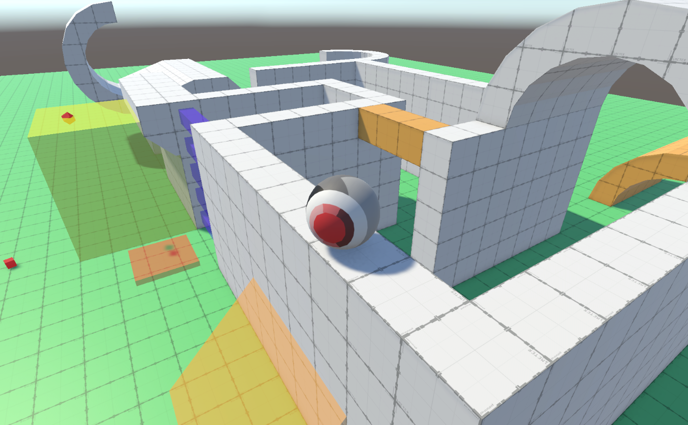

# Rolling Character Controller
 *Following Catlikecoding.com tutorial on Movement* 
 The tutorial mainly focuses on a Third Person Controller that follows a Sphere with drag coefficient of 0.
 It shows some examples on how to implement some behaviors like sliding, rolling, jumping, climbing, swimming, etc. 
 I am currently working on taking some ideas from this Tutorial and applying them to my current Spring-Based Character controller.

---

