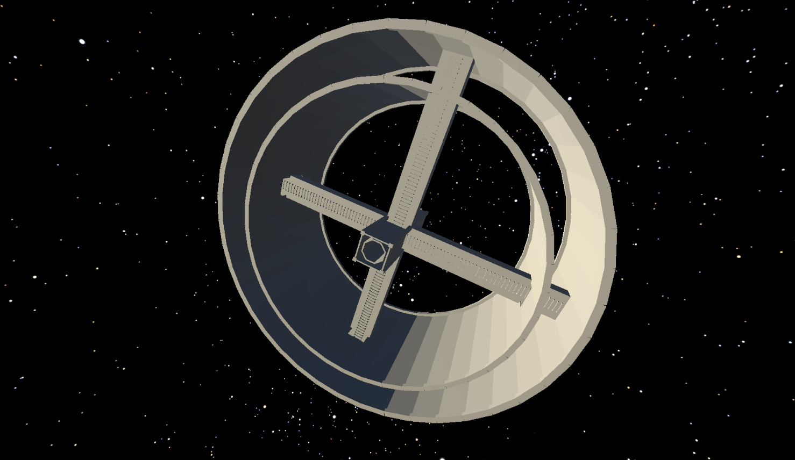

# SpaceShip Demo

---
*2001: A Space Odyssey's inspired Space Station V* 

**Concept:** A cirular shaped Space Station rotating around its central axis in order to *simulate Artificial Gravity via the imaginary Centrifugal Force*.

---

---

**Physics:** Newton's Laws of Motion. It simulates gravity, since an object inside the Spaceship conserves wants to follow a linear path (Newton's 1st Law), when the spaceship rotates, the floor will push the player into a circular motion around its center axis, so it will be following a constant Circular motion around the center axis of the Spaceship, being pushed constantly by the floor. 

So as Newton's Third Law of Motion explains: When two objects interact, they apply forces to each other of equal magnitude and opposite direction.

So if the player is under a constant circular motion, we can compute its Centripetal Force (Fc = linearVelocity^2 * mass / radius), and if we then apply Newton's 3rd and 2nd(F=m*a) Laws:

We then get that the imaginary Centrifugal Force (the opposite of Centripetal Force, due to the interaction between the player and the floor as described in Newton's 3d Law) we get that the acceleration (towards the floor) that the player feels *is Centripetal Force/mass* and that will be its perceived gravity (because for the player it will feel that everything is still inside the spaceship and its under a constant acceleration (very similar to Gravity on Earth)

---

I made an sketch representing this concept in order to Compute approximately what the initial Spin of the Spaceship would need to be in order to feel 0.2g:

---

This was my original concept inspired by the movie:

