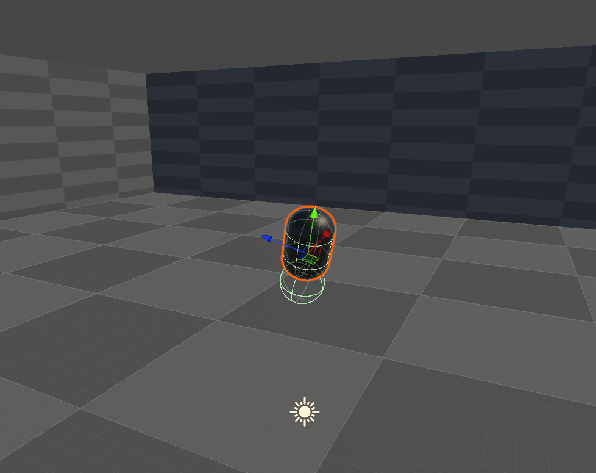
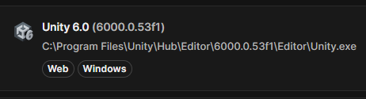

# Unity-Physics-Playground
Unity Physics-based motion project. Experiments showcasing gameplay mechanics

 

---

## About the project
A ~1 000-hour -work in progress- solo project focused on physics gameplay in Unity
Covering:

| Phase | Hours | Key deliverables | Physic Principle |
|-------|-------|------------------|------------------|
| **0 · Setup** | ~10 h | Monorepo, CI | … |
| **1 · Orbits Scene** | ~40 h | Solar system with: a Central Star, a few Planets and a Satellite | Gravity-Based Orbits |
| **2 · Spaceship Scene** | ~50 h | 2001: A Space Odyssey's inspired Space Station V | Centripetal Force simulating Artificial Gravity |
| **3 · Floating Character Controller** | ~100 h | Floating Capsule based on tunable Spring-like motions | Spring Forces: Floating, Moving and Straightening |
| **4 · Rolling Character Controller** | ~60 h | Following Catlikecoding's Movement Tutorial | Rigidbody movement of a Sphere |
| **5 · Procedural Animation** | ~XX h | Using FABRIKS to animate the Character | Inverse Kinematics for Robot-like Limbs |

---

## ShowCases

| Name | Demo Image | Document |
|------|------------|---------|
| **Orbits** |  | [Read more](Docs/orbits.md) |
| **SpaceShip** |  | [Read more](Docs/spaceship.md) |
| **Spring-based Character** |  | [Read more](Docs/springBasedCharacter.md) |
| **Rolling Character** |  | [Read more](Docs/rollingCharacter.md) |

---

## Reproducible environment

| Unity LTS + Web Module |
|------------------------|
|  |

---

## Cloning

```bash
git clone git@github.com:marc-gomez-tejedor/Unity-Physics-Playground.git
# Unity Hub → Add project → select repo root
# Confirm it opens with Unity 6.0 LTS
```
